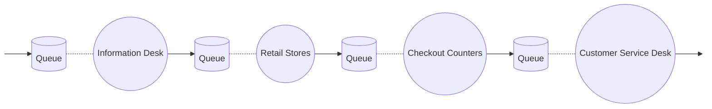
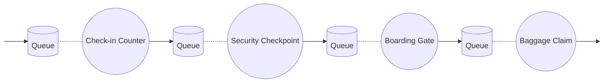

# Task 1: Discussing Performance Measures in a Health Center Context

## Performance Variables Explanation

### Directly Observable Variables

- **Arrived Clients Count (A)**: Number of patients arriving at the health center.
- **Clients Serviced Count (C)**: Number of patients who have received treatment.
- **Active Time in Service Point (B)**: Time during which medical staff are actively treating patients.
- **Total Simulation Time (T)**: The overall duration of the simulation run.

### Derived Variables

- **Service Point Utilization (U)**: Efficiency of the medical staff, \( U = \frac{B}{T} \).
- **Service Throughput (X)**: Rate at which patients are treated, \( X = \frac{C}{T} \).
- **Average Service Time (S)**: Average time taken to treat each patient, \( S = \frac{B}{C} \).

### Additional Directly Observable Variables

- **Response Time (R𝑖)**: Time from the patient's arrival at the service queue to the end of the service.
- **Waiting Time (W)**: Cumulative sum of response times of all clients.

### Further Derived Quantities

- **Average Response Time (R)**: \( R = \frac{W}{C} \).
- **Average Queue Length (N)**: \( N = \frac{W}{T} \).

### Discussion

Using the health center as an example, this task involves a detailed discussion on the meaning and characterization of all the performance measures. The focus should be on how these measures reflect the operational efficiency, patient throughput, and overall service quality in a health center environment. Each variable should be contextualized to demonstrate its impact on both the service provider (the health center) and the service receiver (the patients).

## Performance Variables and Their Implications

### Operational Efficiency

- **Service Point Utilization (U)** and **Average Service Time (S)** are critical indicators of the efficiency of healthcare services in a health center. A higher utilization rate suggests optimal use of medical resources, while a lower average service time implies quick and efficient patient handling.

### Patient Experience

- **Average Response Time (R)** and **Waiting Time (W)** are vital for understanding patient satisfaction and quality of care. Shorter response and waiting times typically indicate a more positive patient experience, reflecting the health center's ability to provide timely care.

### System Capacity and Throughput

- **Service Throughput (X)** and **Average Queue Length (N)** offer insights into the health center’s capacity to manage patient flow. Higher throughput signifies the ability to treat more patients effectively within a given timeframe, while queue length helps gauge the demand and waiting experience of patients.

### Conclusion

These performance measures are integral to assessing and enhancing the operational aspects of a health center. By analyzing these variables, healthcare administrators can identify areas for improvement, ensuring efficient operations and a better patient experience.

# Task 2: Categories for Performance Measures

## Overview

This section outlines the general categories used for maintaining, updating, and computing performance measures in service-oriented systems. The focus is on two main categories: service point and customer.

## Service Point Category

### Utilization and Efficiency

- Measures related to how well a service point is used and how efficiently it operates.
- Key metrics include how much time the service is active and how quickly services are provided to customers.

### Operational Metrics

- Focus on the day-to-day functioning of the service point.
- Includes measures like the number of customers served and how service quality is maintained over time.

## Customer Category

### Experience Metrics

- These metrics are all about the customer's experience with the service.
- They include how long customers wait and their overall satisfaction with the service.

### Queue and Waiting Time Metrics

- These measures focus on the customer's waiting experience.
- Key aspects include the length of the queue and the total time customers spend waiting.

## Conclusion

Understanding these categories helps in effectively analyzing and improving the performance of service systems. It allows for a balanced approach that considers both the efficiency of the service point and the experience of the customer.

# Task 3: Service Point Systems Design

## 1. Shopping Center System

### Service Points

- **Information Desk**: Visitors' first point of contact for information.
- **Retail Stores**: Where customers browse and select items.
- **Checkout Counters**: Payment point for purchases.
- **Customer Service Desk**: For post-purchase services and inquiries.

### Flowchart for Shopping Center

## 2. Airport System

### Service Points

- **Check-in Counter**: Where passengers check in and drop off baggage.
- **Security Checkpoint**: Screening of passengers and carry-ons.
- **Boarding Gate**: Waiting area before boarding.
- **Baggage Claim**: Where passengers collect baggage upon arrival.

### Flowchart for Airport

## 3.

Algorithm: Three-Phase Simulator for Shopping Center

// Initial Setup
Initialize simulation clock to 0
Initialize all queues and service points (router, operator queues) to empty
Schedule initial B events (e.g., B1 for customer type X, B2 for customer Y)

// Main Simulation Loop
while simulation is not complete:
// A-Phase: Advance Clock
Set simulation clock to time of the next scheduled event

    // B-Phase: Process B-Events
    while there are B events at the current clock time:
        Process each B event based on its type
        Update system state accordingly
        Schedule future events as needed (e.g., next customer arrival, finish activity)
        Update statistics if required (e.g., completed work)

    // C-Phase: Process C-Events
    repeat:
        Check for any C events whose conditions are met
        If a C event's condition is met:
            Process the C event
            Update system state accordingly
            Schedule B event for completion of the activity
    until no more C events can be executed

    // Check for end of simulation (e.g., predetermined run length or number of arrivals)

// Finalize Simulation
Compile and output simulation results (e.g., total number of customers processed)
